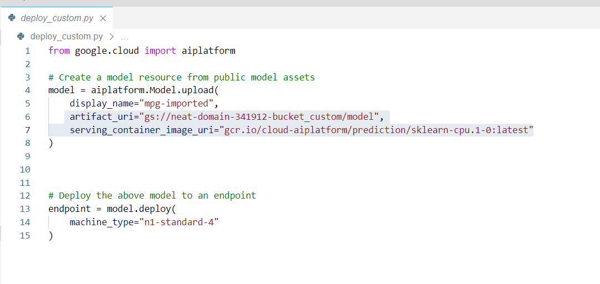
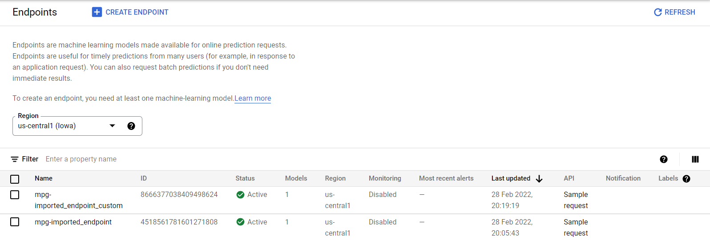
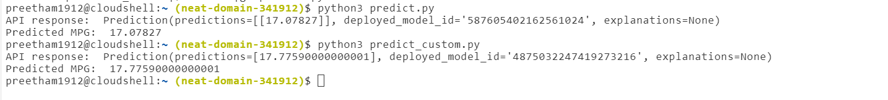

# Digital Product School Challenge 


The solution is implemented using two models that were deployed using Vertex AI. The first model being the model using basic regression model with TensorFlow. The custom model uses the Random forest regressor for obtaining the predictions. 


### Two models folders structure are as follows:


#### Linear Regression Model (Model 1)
```bash
+ mpg/
    + trainer/
        + train.py
    + Dockerfile
    + deploy.py
    + predict.py
```

#### Random Forest Regressor Model (Model 2)
```bash

+ mpg_custom/
    + trainer/
        + train_custom.py
    + Dockerfile
    + deploy_custom.py
    + predict_custom.py

```


-> Training job in the container


First we create training job in a Docker container using Dockerfile and pushing this container to Google Container Registry.
Two respective training models (Linear regression, Random Forest Regressor). Thereby using two training files (train.py and train_custom.py) files that are later deployed and pushed to the Google container registry. 


Model 1 docker image: https://console.cloud.google.com/gcr/images/neat-domain-341912/global/mpg@sha256:ad50a5ba62371a2e09e8888c9dc7a09811c15097442d2e3424bd0928a87da6d4/details?project=neat-domain-341912


Model 2 docker image: https://console.cloud.google.com/gcr/images/neat-domain-341912/global/mpg@sha256:ad50a5ba62371a2e09e8888c9dc7a09811c15097442d2e3424bd0928a87da6d4/details?project=neat-domain-341912


We then proceed to train the model through the Training section in the vertex section of our Cloud console. In the container settings step, we pick the respective container registry for both model 1 and 2 respectively.


-> We create the endpoints for our two models. We use these endpoints to get the predictions using the Vertex API. We create deploy.py and deploy_custom.py 
 Model1 -> 
            
            
Model2- >  
            
            
We then have endpoints for two different models as shown below
 
 


Finally, using the files predict_py (Linear regression Model) and predict_custom.py (Random Forest Regressor model) we acquire following results. 

Linear Regression Model prediction: 17.07827, for input array: test_mpg =  [1, 2, 3, 2, -2, -1, -2, -1, 0]
Random Forest Regressor Model prediction: 17.7590 for input array: test_mpg =  [2, 3, 2, -2, -1, -2, -1, 0].




Since our model 2 has been custom trained, the random forest model expects the test_mpg to have 8 elements. Given test_mpg intially consists of 9 elements (including mpg value) which is the target value for the model. 

I have also included notebook file {} to  describe the pre-processing steps and also implementation of various models and compare their respective peformance to the same dataset. 